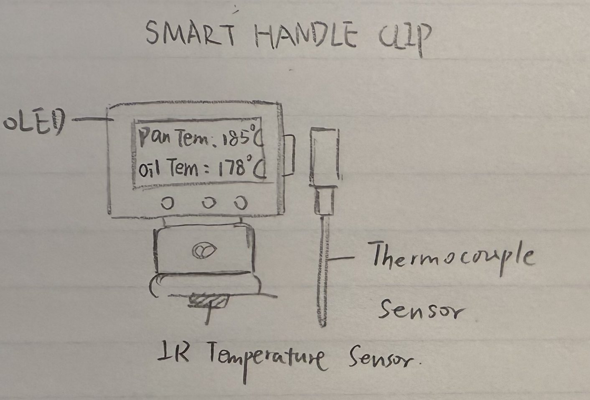
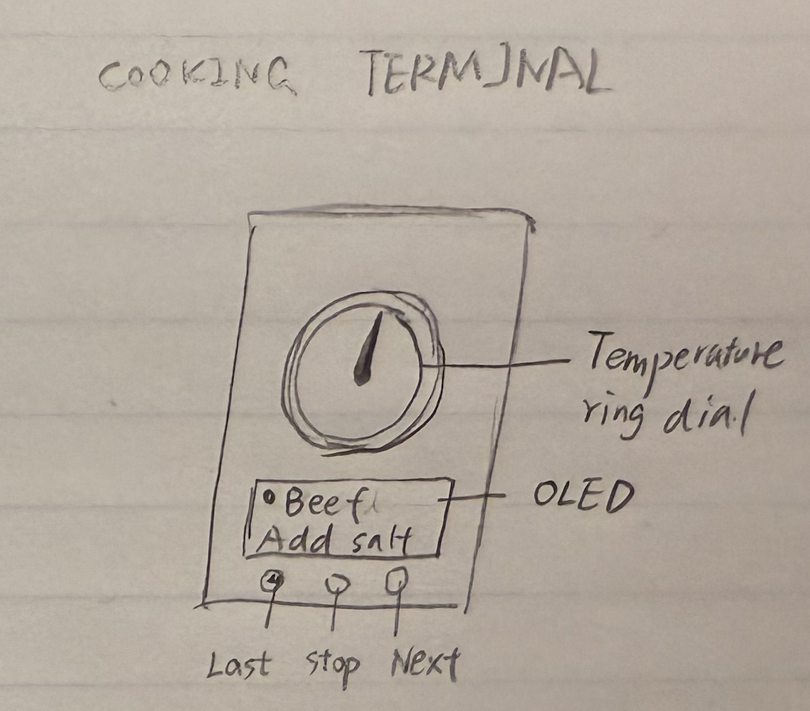
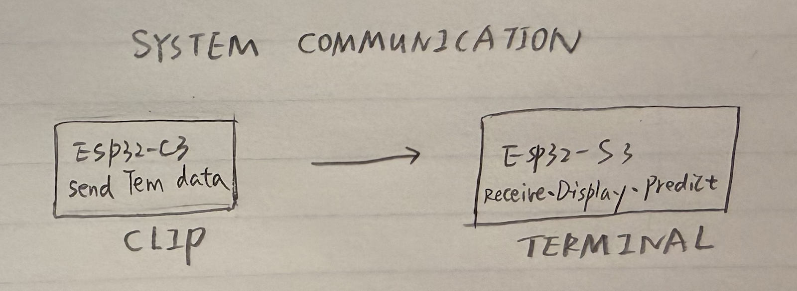

# Smart Kitchen Guide

## Project Overview

**Smart Kitchen Guide** is a two-device cooking assistance system designed to help beginners master temperature control in cooking - from Chinese stir-frying to Western pan-searing. The system consists of a **Smart Handle Clip (Sensing Device)** that clamps onto any pan handle and monitors temperatures using triple sensing technology, and a **Cooking Terminal (Display Device)** that provides visual feedback through a stepper motor-driven gauge, LED indicators, and recipe guidance.

The sensing device wirelessly transmits temperature data to the display device, which uses a predictive algorithm to estimate when the target temperature will be reached and alerts the user at the optimal moment to add ingredients.

### Key Features

- **Triple Temperature Sensing**: Pan surface (IR), oil temperature (IR), and food internal temperature (K-type probe)
- **Universal Compatibility**: Spring-clip design fits handles from 15-40mm diameter
- **Open-Pan Cooking**: Perfect for stir-frying and sautéing without blocking the view
- **Wireless BLE Communication**: Real-time data transmission at 10Hz

### General Sketch


**Physical Features:**
- **Smart Handle Clip**: Spring-loaded clamp with OLED display, IR temperature sensor pointing toward pan body, detachable K-type thermocouple probe, and USB-C rechargeable battery
- **Cooking Terminal**: Retro radio-style desktop unit featuring a large circular temperature gauge with stepper motor-driven needle, RGB LED ring, OLED recipe display, and three tactile buttons (Select/Confirm/Back)

---

## Sensing Device: Smart Handle Clip

### Device Description

The Smart Handle Clip is a portable, clip-on temperature monitoring device that attaches to any pan or wok handle. It features **triple temperature sensing capability**:

1. **Infrared (IR) Sensor** - Non-contact measurement of pan surface and oil temperature
2. **K-Type Thermocouple Probe** - Detachable probe for measuring food internal temperature

The clip-on design allows the pan to remain open during cooking, making it ideal for Chinese stir-frying and Western sautéing where visual monitoring is essential.

### Detailed Sketch



### How It Works

1. **MLX90614 IR sensor** (mounted on bottom jaw, pointing toward pan) measures pan surface temperature from -70°C to +380°C without contact
2. The same IR sensor can measure **oil surface temperature** when the user aims it at the oil (mode switchable via button)
3. **Detachable K-type thermocouple probe** connects via port on the side for measuring food internal temperature (e.g., checking if meat is cooked through)
4. **MAX31855** thermocouple amplifier digitizes the probe signal via SPI
5. **ESP32-C3** microcontroller processes all sensor data at 10Hz and transmits via BLE
6. **0.96" OLED display** shows real-time temperature readings locally
7. **3 Status LEDs** indicate: Green (ready), Yellow (heating), Red (warning/overheat)
8. **500mAh Li-Po battery** provides ~8 hours of operation with USB-C charging

### Components & Part Numbers

| Component | Part Number | Description |
|-----------|-------------|-------------|
| Microcontroller | **ESP32-C3-MINI-1** | WiFi/BLE MCU, low power, SPI/I2C support |
| IR Temperature Sensor | **MLX90614ESF-BAA** | Non-contact IR thermometer, -70°C to +380°C, I2C |
| Thermocouple Sensor | **K-Type Thermocouple Probe** | Detachable, -50°C to +300°C, food-grade stainless steel |
| Thermocouple Amplifier | **MAX31855KASA+T** | Cold-junction compensated, SPI interface |
| OLED Display | **SSD1306 0.96" 128x64** | I2C interface, low power |
| Status LEDs | **0603 SMD LED** | Green, Yellow, Red (x3) |
| Battery | **Li-Po 502535** | 3.7V 500mAh rechargeable |
| Voltage Regulator | **AP2112K-3.3** | 3.3V LDO, 600mA output |
| Charging IC | **TP4056** | 1A Linear Li-ion charger, USB-C |
| Buttons | **TS-1109S** | 6x6mm SMD tact switch (x2: Power, Mode) |


## Display Device: Cooking Terminal

### Device Description

The Cooking Terminal is a desktop unit that receives temperature data from the Smart Handle Clip and provides rich visual feedback. The centerpiece is a large analog-style gauge with a stepper motor-driven needle showing current temperature. An RGB LED ring around the gauge indicates cooking status (heating/ready/overheating), while an OLED screen displays recipe steps and timing information. Users interact via three tactile buttons and can navigate through pre-loaded recipes.

### Detailed Sketch



### How It Works

1. The **ESP32-S3** receives temperature data via BLE from the Smart Handle Clip
2. Temperature prediction algorithm estimates time-to-target based on heating rate
3. The **28BYJ-48 stepper motor** drives the gauge needle to indicate current temperature (0-300°C scale)
4. **WS2812B RGB LED ring** shows status: blue (cold), green (heating), amber (target reached), red (overheating)
5. **1.3" OLED display** shows recipe name, current step, target temperature, and countdown timer
6. Three **tactile buttons** allow navigation: Select (◀), Confirm (✓), Back (↩)
7. **Buzzer** provides audio alerts when target temperature is reached
8. Powered by **18650 Li-ion battery** with USB-C charging

### Components & Part Numbers

| Component | Part Number | Description |
|-----------|-------------|-------------|
| Microcontroller | **ESP32-S3-WROOM-1** | Dual-core, BLE 5.0, sufficient GPIO |
| Stepper Motor | **28BYJ-48** | 5V unipolar, 64:1 gear ratio |
| Stepper Driver | **ULN2003A** | Darlington array driver |
| RGB LED Ring | **WS2812B 16-LED Ring** | Addressable RGB, 5V |
| OLED Display | **SH1106 1.3" 128x64** | I2C interface |
| Tactile Buttons | **TS-1109S** | 6x6mm SMD tact switch (x3) |
| Buzzer | **MLT-5020** | 5V active buzzer |
| Battery | **NCR18650B** | 3.7V 3400mAh Li-ion |
| Battery Charger | **TP4056 Module** | USB-C Li-ion charger with protection |
| Voltage Regulator | **AMS1117-3.3** | 3.3V LDO for logic |
| 5V Boost | **MT3608** | Step-up converter for motor/LED |


## System Communication & Architecture

### Communication Diagram



The Smart Handle Clip and Cooking Terminal communicate via **Bluetooth Low Energy (BLE)**:

- **Protocol**: BLE 5.0 with custom GATT service
- **Update Rate**: 10 Hz (100ms intervals)
- **Range**: Up to 10 meters (typical kitchen environment)
- **Latency**: < 50ms end-to-end


### System Block Diagram

```
┌─────────────────────────────────────────────────────────────────────────────────────┐
│                                 SYSTEM OVERVIEW                                     │
│                                                                                     │
│                                                                                     │
│    ┌──────────────────────┐                         ┌──────────────────────┐        │
│    │                      │                         │                      │        │
│    │   SENSING DEVICE     │      BLE 5.0 Link       │   DISPLAY DEVICE     │        │
│    │  (Smart Handle Clip) │ ═══════════════════════►│  (Cooking Terminal)  │        │
│    │                      │      10Hz, <50ms        │                      │        │
│    │                      │                         │                      │        │
│    └──────────────────────┘                         └──────────────────────┘        │
│                                                                                     │
│                                                                                     │
└─────────────────────────────────────────────────────────────────────────────────────┘
```

---

## Sensing Device (Smart Handle Clip)

```
┌─────────────────────────────────────────────────────────────────────────────────────┐
│                        SMART HANDLE CLIP (Sensing Device)                           │
│                                                                                     │
│                                                                                     │
│    ┌──────────────┐                             ┌──────────────┐                    │
│    │  MLX90614    │                             │ Xiao         │                    │
│    │  IR Sensor   ├──────────────┐      ┌───────┤ ESP32-C3     │                    │
│    │  (I2C)       │              │      │       │ (BLE TX)     │                    │
│    └──────────────┘              │      │       └───────┬──────┘                    │
│                                  │      │               │                           │
│                                  ▼      ▼               │                           │
│                              ┌──────────────┐           │          BLE 5.0          │
│                              │              │           │         ════════►         │
│                              │  Processing  │◄──────────┘                           │
│                              │              │                                       │
│                              └──────┬───────┘                                       │
│                                     │                                               │
│                           ┌─────────┴─────────┐                                     │
│                           │                   │                                     │
│                           ▼                   ▼                                     │
│                    ┌──────────────┐    ┌──────────────┐                             │
│                    │  WS2812B     │    │   Rotary     │                             │
│                    │  RGB LED     │    │   Encoder    │                             │
│                    │  (x1)        │    │   (EC11)     │                             │
│                    └──────────────┘    └──────────────┘                             │
│                                                                                     │
│                                                                                     │
│    ┌──────────────┐         ┌──────────────────────────────────────┐                │
│    │  Li-Po       │         │      Xiao ESP32-C3 Built-in          │                │
│    │  500mAh      ├────────►│  ┌────────────┐    ┌────────────┐    │                │
│    │  3.7V        │         │  │  TP4056    │    │   3.3V     │    │                │
│    └──────────────┘         │  │  Charger   │    │   LDO      │    │                │
│           ▲                 │  └──────┬─────┘    └──────┬─────┘    │                │
│           │                 │         │                 │          │                │
│       USB-C ────────────────┼─────────┘                 └──────────┼───► 3.3V       │
│                             │                                      │                │
│                             └──────────────────────────────────────┘                │
│                                                                                     │
│                                                                                     │
└─────────────────────────────────────────────────────────────────────────────────────┘
```

---

## Display Device (Cooking Terminal)

```
┌─────────────────────────────────────────────────────────────────────────────────────┐
│                        COOKING TERMINAL (Display Device)                            │
│                                                                                     │
│                                              │                                      │
│                                              │ BLE 5.0                              │
│                                              ▼                                      │
│                                      ┌──────────────┐                               │
│                              ┌───────┤ Xiao         │                               │
│                              │       │ ESP32-C3     ├───────┐                       │
│                              │       │ (BLE RX)     │       │                       │
│                              │       └──────────────┘       │                       │
│                              │               │              │                       │
│                              │               │              │                       │
│      ┌───────────────────────┼───────────────┼──────────────┼───────────────┐       │
│      │                       │               │              │               │       │
│      ▼                       ▼               ▼              ▼               ▼       │
│ ┌──────────┐ ┌──────────┐ ┌──────────┐ ┌──────────┐ ┌──────────┐ ┌──────────┐       │
│ │ ULN2003A │ │ WS2812B  │ │ SH1106   │ │ Rotary   │ │ Piezo    │ │ Temp     │       │
│ │ Driver   │ │ RGB Ring │ │ OLED     │ │ Encoder  │ │ Buzzer   │ │ Predict  │       │
│ │          │ │ (x8)     │ │ 1.3"     │ │ (EC11)   │ │          │ │ Algo     │       │
│ └────┬─────┘ └──────────┘ └──────────┘ └──────────┘ └──────────┘ └──────────┘       │
│      │                                                                              │
│      ▼                                                                              │
│ ┌──────────┐                                                                        │
│ │ 28BYJ-48 │                                                                        │
│ │ Stepper  │                                                                        │
│ │ Motor    │                                                                        │
│ └────┬─────┘                                                                        │
│      │                                                                              │
│      ▼                                                                              │
│ ┌──────────┐                                                                        │
│ │ Gauge    │                                                                        │
│ │ Needle   │                                                                        │
│ └──────────┘                                                                        │
│                                                                                     │
│                                                                                     │
│    ┌──────────────┐       ┌──────────────┐                                          │
│    │  18650       │       │   TP4056     │◄──── USB-C                               │
│    │  Battery     ├──────►│   Charger    │                                          │
│    │  3400mAh     │       │   (Xiao)     │                                          │
│    └──────────────┘       └───────┬──────┘                                          │
│                                   │                                                 │
│                    ┌──────────────┴──────────────┐                                  │
│                    │                             │                                  │
│                    ▼                             ▼                                  │
│            ┌──────────────┐             ┌──────────────┐                            │
│            │  Xiao 3.3V   │             │   MT3608     │                            │
│            │  LDO         │             │   Boost      │                            │
│            └───────┬──────┘             └───────┬──────┘                            │
│                    │                            │                                   │
│                    ▼                            ▼                                   │
│              3.3V (Logic)                 5V (Motor/LED)                            │
│              • Xiao MCU                   • ULN2003A                                │
│              • SH1106 OLED                • 28BYJ-48                                │
│              • Rotary Encoder             • WS2812B                                 │
│                                           • Piezo Buzzer                            │
│                                                                                     │
└─────────────────────────────────────────────────────────────────────────────────────┘
```

---

## Complete System Block Diagram

```
┌─────────────────────────────────────────────────────────────────────────────────────┐
│                        SMART HANDLE CLIP (Sensing Device)                           │
│                                                                                     │
│    ┌──────────────┐              ┌──────────────┐        ┌──────────────┐           │
│    │  MLX90614    │    I2C       │              │        │  WS2812B     │           │
│    │  IR Sensor   ├─────────────►│ Xiao         │◄───────┤  RGB LED     │           │
│    └──────────────┘              │ ESP32-C3     │        │  (x1)        │           │
│                                  │              │        └──────────────┘           │
│    ┌──────────────┐    GPIO      │ (BLE TX)     │        ┌──────────────┐           │
│    │  Rotary      ├─────────────►│              │        │  Li-Po       │           │
│    │  Encoder     │              └───────┬──────┘        │  500mAh      │           │
│    └──────────────┘                      │               └───────┬──────┘           │
│                                          │                       │                  │
│                                          │ BLE 5.0               │ Power            │
│                                          │                       ▼                  │
│                                          │               ┌──────────────┐           │
│                                          │               │ Xiao Built-in│           │
│                                          │               │ Charger+LDO  │◄── USB-C  │
│                                          │               └──────────────┘           │
│                                          │                       │                  │
│                                          │                       ▼                  │
│                                          │                    3.3V Out              │
└──────────────────────────────────────────┼──────────────────────────────────────────┘
                                           │
                                           │
                        ═══════════════════╪═══════════════════
                              Wireless     │     Communication
                        ═══════════════════╪═══════════════════
                                           │
                                           │
┌──────────────────────────────────────────┼──────────────────────────────────────────┐
│                        COOKING TERMINAL (Display Device)                            │
│                                          │                                          │
│                                          ▼                                          │
│    ┌──────────────────────────────────────────────────────────────────────────┐     │
│    │                            Xiao ESP32-C3                                 │     │
│    │                              (BLE RX)                                    │     │
│    │                                                                          │     │
│    │    ┌──────────────┐                                                      │     │
│    │    │    Temp      │                                                      │     │
│    │    │   Predict    │                                                      │     │
│    │    │    Algo      │                                                      │     │
│    │    └──────────────┘                                                      │     │
│    │                                                                          │     │
│    └───┬────────┬────────┬────────┬────────┬────────┬─────────────────────────┘     │
│        │        │        │        │        │        │                               │
│        ▼        ▼        ▼        ▼        ▼        ▼                               │
│   ┌────────┐┌────────┐┌────────┐┌────────┐┌────────┐┌────────┐                      │
│   │ULN2003A││WS2812B ││SH1106  ││Rotary  ││Piezo   ││        │                      │
│   │ Driver ││RGB Ring││OLED    ││Encoder ││Buzzer  ││        │                      │
│   └───┬────┘│ (x8)   ││ 1.3"   │└────────┘└────────┘│        │                      │
│       │     └────────┘└────────┘                    │        │                      │
│       ▼                                             │        │                      │
│   ┌────────┐                                        │        │                      │
│   │28BYJ-48│                                        │        │                      │
│   │Stepper │                                        │        │                      │
│   │ Motor  │                                        │        │                      │
│   └───┬────┘                                        │        │                      │
│       │                                             │        │                      │
│       ▼                                             │        │                      │
│   ┌────────┐                                        │        │                      │
│   │ Gauge  │                                        │        │                      │
│   │ Needle │                                        │        │                      │
│   └────────┘                                        │        │                      │
│                                                     │        │                      │
│                                                     │        │                      │
│    ┌──────────────┐      ┌──────────────┐           │        │                      │
│    │   18650      │      │   Xiao       │◄── USB-C  │        │                      │
│    │   Battery    ├─────►│   Charger    │           │        │                      │
│    │   3400mAh    │      └───────┬──────┘           │        │                      │
│    └──────────────┘              │                  │        │                      │
│                                  │                  │        │                      │
│                    ┌─────────────┴─────────────┐    │        │                      │
│                    │                           │    │        │                      │
│                    ▼                           ▼    │        │                      │
│            ┌──────────────┐            ┌──────────────┐      │                      │
│            │    3.3V      │            │   MT3608     │      │                      │
│            │    LDO       │            │   5V Boost   │      │                      │
│            └───────┬──────┘            └───────┬──────┘      │                      │
│                    │                           │             │                      │
│                    ▼                           ▼             │                      │
│               3.3V (Logic)                5V (Motor/LED)     │                      │
│                                                              │                      │
└─────────────────────────────────────────────────────────────────────────────────────┘
```


